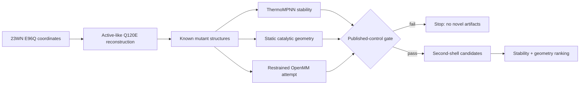

# Atlas v1

Atlas is a validation-gated computational pipeline for prioritizing mutations to
the published DP622 metalloprotease scaffold. It reconstructs an **active-like**
DP622–Aβ coordinate model from PDB 23WN, checks the workflow against published
mutation controls, and generates novel computational candidates only if that
benchmark gate passes.

Atlas produces computational predictions for future experimental testing. It
does not establish catalytic improvement, therapeutic benefit, or experimental
validation.

## Why 23WN needs reconstruction

23WN is the published pre-catalytic cryo-EM complex of an inactive DP622 E96Q
construct with a resolved Aβ segment and zinc. Deposited chain A residues 25–239
map to DP622 residues 1–215. Atlas extracts that domain, renumbers it, retains
Aβ residues B34–41 and zinc, and makes the explicit isosteric coordinate edit
deposited Q120 → DP622 E96. The output is therefore called an **active-like
reconstruction**, never an experimentally observed active structure.

The benchmark controls are Y91F and D126A (published beneficial-looking trends),
H172A (regressive), and Y91F/D126A (strongly regressive). Published measurements
label the gate; they are not model inputs or claimed prospective validation.

## Workflow and hard stop



ThermoMPNN and ThermoMPNN-D estimate mutation-associated stability changes;
they do not predict catalysis. Catalytic geometry is evaluated separately using
centralized atom selectors for zinc, the deposited scissile carbonyl, zinc
ligands, reconstructed E96, H172, and the Y91/D126 pocket. OpenMM is comparative
screening, not publication-grade MD. If the truncated metalloprotease/substrate/
zinc system cannot be parameterized, Atlas records the original failure, emits
no fake snapshots, and uses explicitly labeled static geometry.

Novel candidate generation is physically downstream of `require_validation_pass`.
A failed gate exits nonzero and cannot create a novel manifest, ranking, top-five
PDB directory, or candidate-ranking figure.

## Architecture

The implementation is a direct Python pipeline because the phase order is a
scientific invariant; LangGraph would add state machinery without improving the
fixed hard-stop workflow.

| Package | Responsibility |
| --- | --- |
| `structure` | 23WN extraction, numbering, Q120E reconstruction, deterministic mutations |
| `stability` | Validated adapters around pinned official ThermoMPNN repositories |
| `geometry` | Atom selection, distances, aligned RMSDs, substrate/pocket metrics |
| `dynamics` | Restrained OpenMM minimization/short-MD attempt and honest fallback |
| `validation` | Published-control classifications and non-negotiable gate |
| `design` | Protected-site exclusions, interpretable candidates, transparent ranking |
| `reporting` | CSVs, provenance, warnings, and deterministic PNG figures |

Rosetta, PyRosetta, Docker, LangGraph, and Streamlit are not active v1
dependencies. The prior synthetic application is removed from the package;
source-recovery metadata is preserved under `archive/legacy_v0/`.

## Quick start

Prerequisites: Python 3.10–3.12. Structural reconstruction and all unit tests run on
CPU without the external neural models.

```bash
python3 -m venv .venv
source .venv/bin/activate
python -m pip install --upgrade pip
python -m pip install -e '.[dev,dynamics]'
atlas reconstruct --input data/23WN.cif --output-dir outputs/reconstruction
python -m pytest -q
```

For a full GPU run, clone the official model repositories at the recorded
revisions and install their documented dependencies:

```bash
mkdir -p .external
git clone https://github.com/Kuhlman-Lab/ThermoMPNN.git .external/ThermoMPNN
git -C .external/ThermoMPNN checkout 2b04fd370e399911b1fa5848112cc9013f084110
git clone https://github.com/Kuhlman-Lab/ThermoMPNN-D.git .external/ThermoMPNN-D
git -C .external/ThermoMPNN-D checkout df9a75aaddb674a7c4c193005031fc0536d325fb
python -m pip install omegaconf wandb pytorch-lightning scipy scikit-learn joblib
atlas run --input data/23WN.cif --output-root outputs --thermompnn-repo .external/ThermoMPNN --thermompnn-d-repo .external/ThermoMPNN-D --dynamics-mode minimize
```

ThermoMPNN-D's pinned epistatic path currently requires CUDA. Missing repos,
CUDA failures, malformed CSVs, and missing requested mutation rows stop the real
pipeline with an actionable error; scientific fixtures exist only in tests.

## Colab

Open [`notebooks/Atlas_DP622_Colab.ipynb`](notebooks/Atlas_DP622_Colab.ipynb),
select a GPU runtime, and run cells in order. The notebook clones this project
and both official model repositories at fixed commits, installs OpenMM and model
dependencies, verifies CUDA, runs the same CLI, displays validation/figures, and
downloads a ZIP of the fresh run directory.

Expected wall time on a Colab GPU is roughly 15–45 minutes including installation
and model inference. Structural-only reconstruction is normally under one minute.
Restrained 10 ps short MD (`--dynamics-mode short-md`) can add 10–60 minutes if
parameterization succeeds across all structures; the default minimization path is
faster. Runtime varies with Colab hardware and the number of post-gate candidates.

## Outputs

Each execution uses a fresh `outputs/run-<UTC timestamp>/` directory. Before the
gate, expect:

- `DP622_active_like_reconstruction.pdb`
- `residue_numbering_map.csv`
- `known_mutants_manifest.csv` and `known_mutant_pdbs/`
- `thermompnn_scores.csv`
- `geometry_metrics.csv`
- `openmm_dynamics_summary.csv` and `openmm_snapshot_metrics.csv`
- `known_mutation_validation.csv` and `validation_report.md`
- `pipeline_warnings.md`, `provenance.json`
- `figures/validation_dashboard.png`
- `figures/catalytic_geometry_boxplots.png`

Only after a passing gate, expect:

- `novel_candidates_manifest.csv` and `novel_candidate_pdbs/`
- `novel_thermompnn_scores.csv` and `novel_geometry_metrics.csv`
- `novel_candidates_ranked.csv`
- `top_5_candidate_pdbs/`
- `figures/candidate_ranking_summary.png`

Lower predicted ΔΔG is interpreted only as a more favorable stability trend.
Geometry columns are distances/RMSDs in Å. Null snapshot fields plus a warning
mean OpenMM evidence was unavailable—not that the structure was stable.

## Documentation

- [`docs/scientific_decisions.md`](docs/scientific_decisions.md)
- [`docs/limitations.md`](docs/limitations.md)
- [`docs/reproduction.md`](docs/reproduction.md)
- [`docs/superpowers/specs/2026-08-19-atlas-v1-dynamic-geometry-design.md`](docs/superpowers/specs/2026-08-19-atlas-v1-dynamic-geometry-design.md)

Future scientific work could add validated metalloprotease parameterization,
longer replicate MD, QM/MM treatment, optional secondary Rosetta refinement, a
larger mutation library, and—most importantly—blinded wet-lab testing.
